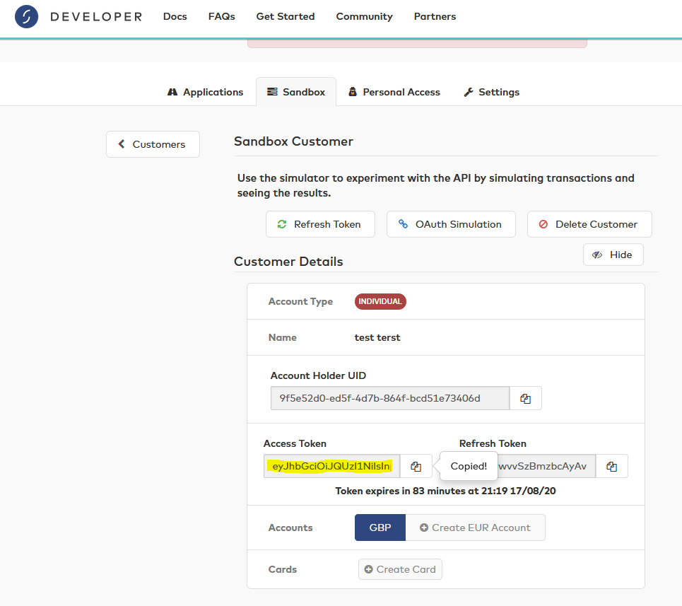

# Starling-Bank Roundup Microservice
A spring-boot application to call Starling Bank APIs to complete the roundup feature. 

Some design choices/assumptions that were made:
- Only GBP accounts are supported.
- Roundup will only be conducted on the most recently created user account.
- A default savings bucket will be made if one doesn't exist - otherwise the most recent one will be the one to deposit into.
- 400 - Bad request will be returned if the user has insufficient funds to do the transfer, or has no GBP accounts.
- 503 - Service Unavailable will be returned if the service cannot call the starling API's
- 403 - Forbidden will be returned if the service given Access-Token is invalid.
- 500 - Internal Service Error will be returned for unhandled generic Exception.

Run the tests with `mvn clean test`

Start the service with `mvn spring-boot:run`

The endpoint is http://localhost:8080/weekly-roundup

Once the service is running you can view the generated documentation and call the service using the following swagger URL http://localhost:8080/swagger-ui.html

The service needs a header called "Access Token" - this token should be the exact string as taken from a sandbox customers Access Token. I am using this token to auth the downstream API calls.

